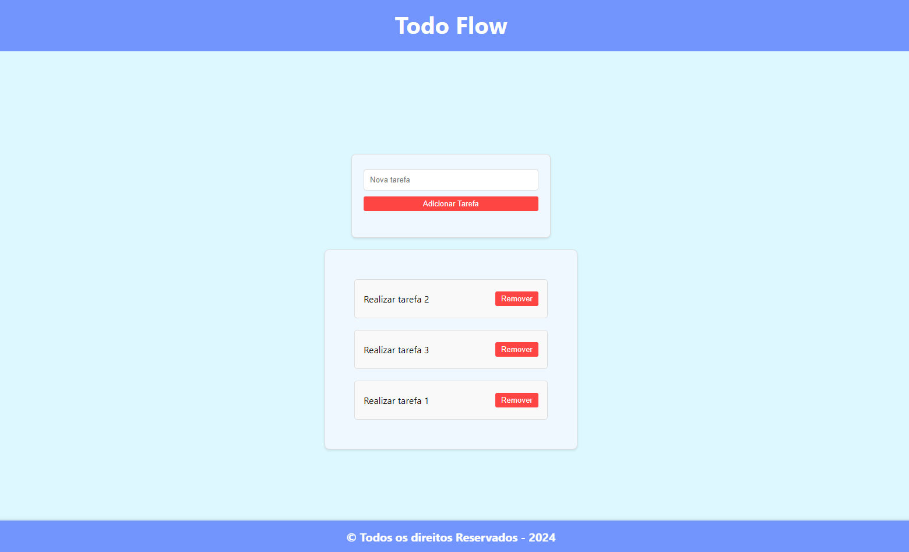

# 📝Todo Flow



## 💻 Sobre o projeto

📄 Todo Flow é um projeto de lista de tarefas

## Projeto desenvolvido durante o Bootcamp de desenvolvimento frontend oferecido pela [Italents](https://italents.com.br).

## ⚙️ Funcionalidades

- [x] Página inicial:
  - [x] Input com botão de adicionarFormulário de criação de tarefa
  - [x] É possível criar uma listagem de tarefas
  - [x] É possível exclusão de tarefa

### Tecnologias usadas:

<div align="left">
  
  
  
  
  
</div>

## Pré-requisitos

- [VSCode](https://code.visualstudio.com/)
- [Git](https://git-scm.com)

## 🛣️ Como executar o projeto

```sh
$ git clone git@github.com:Ana-Alice-Honorio/todo-flow.git
```

```sh
cd todo-flow
```

```sh
npm install
```

### Compilar para desenvolvimento

```sh
npm run start
```

### Compilar para produção

```sh
npm run build
```

### **Utilitários**

- Editor: **[Visual Studio Code](https://code.visualstudio.com/)**
- Ícones: **[Emoji para copiar](https://www.invertexto.com/emojis-para-copiar)**
- Cores e estilos: **[CSS](https://developer.mozilla.org/pt-BR/docs/Web/CSS)**
- Paleta: **[Cores](https://paletadecores.com/paleta/7195fd/8caefe/a7c7fe/c2dfff/ddf8ff/)**
